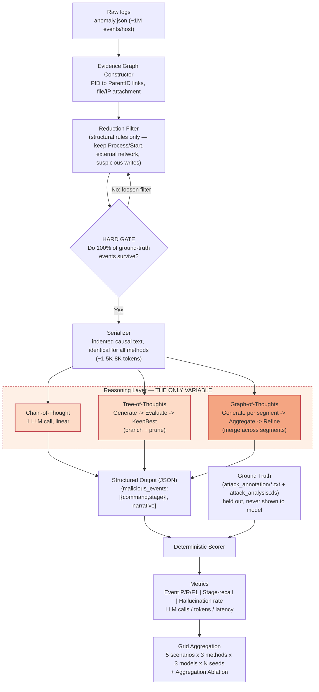
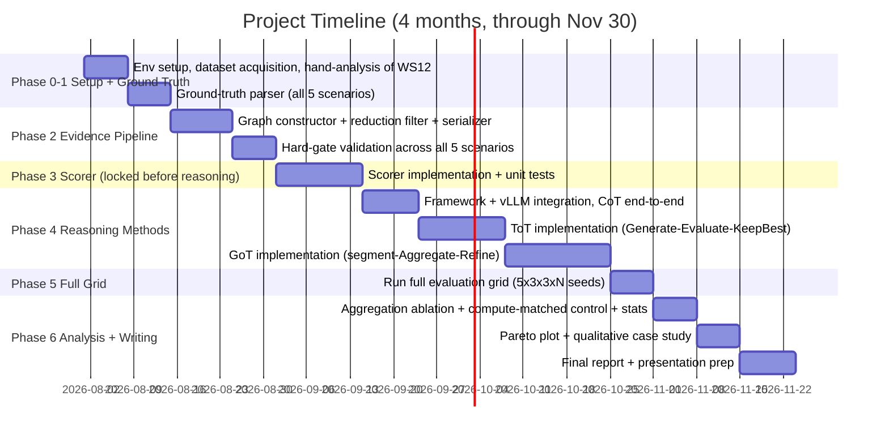

# Graph-of-Thoughts for Multi-Stage Attack Investigation
### Comparing Chain, Tree, and Graph Reasoning for Kill-Chain Reconstruction

---

## 1. Title

**Project Title:** Graph-of-Thoughts for Multi-Stage Attack Investigation: Comparing Chain, Tree, and Graph Reasoning for Kill-Chain Reconstruction

**Team Names & Roll Numbers:** *[TO BE FILLED]*

**Supervisor:** *[TO BE FILLED]*

**Domain / Track:** *[TO BE FILLED]*

---

## 2. Introduction & Motivation

Modern enterprise hosts generate on the order of **10⁵–10⁶ log events per day** (process starts, file I/O, network I/O). A multi-stage attack — initial access, execution, discovery, credential theft, lateral movement, persistence — leaves behind only a handful of malicious events (often **6–37**) buried inside that volume. Security Operations Centers (SOCs) are chronically understaffed relative to alert volume, and manual correlation of scattered log events into a coherent attack narrative ("kill-chain reconstruction") is one of the most time-consuming tasks an analyst performs.

Two forces make this the right moment for this project:

- **Industry driver:** cloud intrusion volume grew ~75% between 2022 and 2023 (CrowdStrike Global Threat Report, 2024), while analyst headcount has not scaled proportionally — automated investigation support is a direct, near-term SOC need, not a speculative one.
- **Technology driver:** open-weight LLMs (Llama 3.1, Qwen 2.5, Phi-4) are now strong enough to run locally at low cost and reason over structured evidence, and a family of *prompting topologies* — Chain-of-Thought, Tree-of-Thoughts, Graph-of-Thoughts — has emerged that changes not what the model knows, but *how it is allowed to combine what it's given*. Whether this structural choice matters for a real investigative task, rather than only for math/puzzle benchmarks, is untested.

This project sits at the intersection: it uses cyber-attack reconstruction as a rigorous testbed to answer a reasoning-methodology question with direct SOC relevance.

---

## 3. Literature Review

Grouped by theme, not as a flat list.

### Theme A — LLM Reasoning Topologies (the independent variable)

| Paper | Method | Dataset/Task | Result | Limitation |
|---|---|---|---|---|
| Wei et al., *"Chain-of-Thought Prompting Elicits Reasoning in Large Language Models,"* NeurIPS 2022 | Single continuous generation with intermediate reasoning steps before the final answer | Arithmetic, commonsense, symbolic reasoning benchmarks | Large gains over direct prompting on multi-step reasoning tasks | No mechanism to revisit or correct an early wrong step — errors propagate irreversibly to the final answer |
| Yao et al., *"Tree of Thoughts: Deliberate Problem Solving with Large Language Models,"* NeurIPS 2023 | Generate → self-Evaluate → prune (BFS/DFS) over branching "thoughts" | Game of 24, Creative Writing, Mini Crosswords | Game of 24 success: 4% (CoT) → 74% (ToT) with GPT-4 | Every node has exactly one parent — evidence explored in a pruned branch is permanently lost to sibling branches |
| Besta et al., *"Graph of Thoughts: Solving Elaborate Problems with Large Language Models,"* AAAI 2024 | Adds **Aggregate** (many-parent, one-child merge) and **Refine** (self-loop) to Generate/Evaluate | Sorting, keyword counting/summarization, set operations, document merging | +70% quality over CoT and +62% over ToT on sorting, with >31% lower cost than ToT | Evaluated only on abstract/synthetic tasks with clean, fully-specified inputs — never on noisy, real-world evidence with an adversarial signal buried in it |
| Zhang et al., *"Chain of Preference Optimization,"* NeurIPS 2024 | Fine-tunes an LLM on ToT's search-tree preference signal so a single CoT pass approximates ToT quality | QA, fact verification, arithmetic reasoning | CoT-level inference cost with ToT-level accuracy after fine-tuning | Requires training/fine-tuning (violates an inference-only, no-training design); does not test whether *aggregation* (GoT's distinguishing operation) can be replicated this way |

### Theme B — Automated Attack Reconstruction on Provenance/Audit Logs

| Paper | Method | Dataset | Result | Limitation |
|---|---|---|---|---|
| Li et al., *"NODLINK: An Online System for Fine-Grained APT Attack Detection and Investigation,"* NDSS 2024 | Online provenance-graph anomaly detection + investigation, introduces the Simulated-Data benchmark used in this project | Self-published simulated Windows/Linux multi-stage attacks (WS12, Ubuntu, W10/APT29/Sidewinder/FIN6) | High detection accuracy at production-level throughput; reported F1 ≈ 0.248 in later comparative work | No LLM reasoning component; investigation output is a graph, not a stage-labeled narrative — provides no reasoning-topology signal |
| Aly, Mansour & Youssef, *"OCR-APT: Reconstructing APT Stories from Audit Logs using Subgraph Anomaly Detection and LLMs,"* ACM CCS 2025 | Stage 1: trained GNN (relational GCN + one-class SVM per node type) flags anomalous subgraphs. Stage 2: LLM (RAG-based, memory reset per report) narrates the flagged subgraph | DARPA TC3, OpTC, NODLINK/Simulated-Data | F1 ≈ 0.96 on this dataset family, beating NODLINK (0.248) | The LLM never performs detection or linking — it is a summarizer of evidence a separately-trained detector already isolated. Reasoning topology is not a variable at all in this design |

### Theme C — LLM Agents for Security Investigation (contrast case)

| Paper | Method | Dataset | Result | Limitation |
|---|---|---|---|---|
| Wu et al., *"ExCyTIn-Bench: Evaluating LLM Agents on Cyber Threat Investigation,"* ICML 2026 | ReAct-style agent issues SQL queries against 57 Microsoft Sentinel log tables; graded against investigation-graph ground truth | Controlled Azure tenant, 7,542 generated questions (589 test) | Best model reward: 0.606, "leaving much headroom" | Query-writing (SQL) skill is confounded with investigative reasoning — the authors report query success drives the large majority of reward variance, so the benchmark cannot isolate reasoning quality from tool-use skill |

---

## 4. Research Gap

Drawn directly from the table above, not generic:

1. **No work isolates reasoning topology as the sole variable in attack reconstruction.** OCR-APT (Theme B) removes the question entirely by handing detection to a trained GNN — the LLM's reasoning structure cannot matter because the LLM isn't doing the investigative reasoning. ExCyTIn-Bench (Theme C) lets the LLM reason, but confounds reasoning quality with SQL/tool-use skill. **No benchmark holds evidence, model, and detection method fixed while varying only chain/tree/graph reasoning structure on a multi-stage attack task.**

2. **GoT's aggregation operation has never been tested on a task where it should matter most.** CoT/ToT/GoT (Theme A) are validated on sorting, keyword counting, Game of 24 — tasks with clean, fully-specified inputs. None test the specific structural property multi-stage attack investigation has: causally-related evidence scattered non-contiguously across a huge noisy log, where each piece looks weak in isolation and only becomes conclusive once merged with a separately-reasoned piece. Whether GoT's synthetic-task gains (+62–70% over ToT/CoT) transfer to this property is untested.

3. **The CoT→ToT accuracy/cost tradeoff has been attacked via fine-tuning (CPO, Theme A), never via topology comparison under a no-training constraint.** CPO distills ToT's search benefit into a single CoT pass through additional training. No published work asks the inference-only version of this question: does GoT's aggregation add something a *tree* structurally cannot express, holding the model weights completely fixed — which is the more diagnostic question about *why* structure matters, not just *whether* more compute helps.

---

## 5. Problem Statement

> State-of-the-art attack-reconstruction systems (e.g., OCR-APT) rely on a separately-trained detector to identify malicious subgraphs, relegating the LLM to summarizing evidence it did not itself discover; consequently, it is unknown whether an LLM's own reasoning can perform the investigative task unassisted, and whether the *topology* of that reasoning — chain, tree, or graph — changes reconstruction quality. This work removes the trained detector, holds the evidence, serialization, and model weights fixed, and measures kill-chain reconstruction quality purely as a function of reasoning topology.

**In scope:** inference-only comparison of CoT / ToT / GoT on a fixed, rule-based candidate-evidence set; NODLINK Simulated-Data (5 multi-stage attacks, Windows Server 2012 / Ubuntu / Windows 10); 3 open-weight local models, no fine-tuning; event-level, stage-level, and efficiency (cost/latency) evaluation.

**Out of scope:** training or fine-tuning any model; building a novel detector (the reduction step is deliberately simple, structural, and held fixed across all methods); real-time/streaming detection; live network defense; generalization claims beyond the 5 evaluated scenarios.

---

## 6. Hypothesis

**Primary hypothesis (H1) — falsifiable:**
> Graph-of-Thoughts reasoning, through its **Aggregate** operation (merging conclusions reached independently over separate segments of the log), reconstructs multi-stage attacks with **higher stage-level recall** than Chain-of-Thought or Tree-of-Thoughts — because aggregation can connect attack steps that look benign in isolation but become unambiguously malicious once linked, a connection that single-parent reasoning structures (chain, tree) cannot make in one step.

**Null hypothesis (H0):**
> Stage-level recall does not differ significantly across CoT, ToT, and GoT once the evidence set, model weights, and prompt content are held fixed — i.e., reasoning topology has no measurable effect on kill-chain reconstruction quality for this task, and any observed differences are noise.

**Formal basis for H1 (from Besta et al. [3]):** define the *volume* of a thought as the number of earlier thoughts reachable from it via directed edges — i.e., how much prior reasoning could have informed it. For a process producing $N$ thoughts with branching factor $k$:

| Method | Latency (longest path) | Volume of final thought |
|---|---|---|
| CoT | $N$ | $N$ |
| ToT | $\log_k N$ | $O(\log_k N)$ |
| GoT | $\log_k N$ | $N$ |

GoT is the only scheme with both low latency (like a tree) **and** full volume (like a chain), because its aggregation node is reachable from every independently-reasoned segment, while a tree discards everything outside the one surviving root-to-leaf path. This is the structural reason H1 predicts a stage-recall advantage specific to aggregation, not merely "more branching helps."

**Testable predictions (what confirms or rejects H1):**
1. **Main effect:** stage-recall(GoT) > stage-recall(ToT) > stage-recall(CoT), aggregated across all 5 scenarios and seeds, with the GoT-vs-ToT gap statistically distinguishable (paired bootstrap/Wilcoxon test) — this isolates aggregation's contribution specifically, since ToT already has branching and evaluation.
2. **Ablation control:** GoT-with-Aggregate outperforms GoT-without-Aggregate (independent segment generations, best one kept, no merge) at an equal or higher LLM-call budget — this rules out "more calls = better" as the explanation and isolates aggregation as the mechanism.
3. **Cost is not part of the claim:** H1 predicts an accuracy effect only; GoT is expected to incur the highest LLM-call and token cost of the three, reported separately via the accuracy–cost Pareto plot, not blended into the accuracy result.

**Falsifiability statement:** if GoT's stage-recall is statistically indistinguishable from, or lower than, ToT/CoT even after the ablation control isolates aggregation, H1 is rejected — a valid, publishable negative result indicating that linear/tree reasoning already suffices for this task at current 7–8B model scale. The experimental design (Section 7) is constructed so that either outcome is interpretable, because evidence, model, and prompt content are the only things ever held fixed while topology varies.

---

## 7. Objectives

1. Build a **fixed evidence pipeline** that reduces each host's ~1M raw events to a candidate set, serialized identically for all three methods — verified by a hard gate confirming **100% of ground-truth annotated attack events survive reduction**, so recall is never capped by preprocessing.
2. Implement **all three reasoning topologies** (CoT, ToT, GoT) over the same three frozen local models using the `spcl/graph-of-thoughts` framework — verified by producing valid, parseable structured output for every (scenario × method × model) cell.
3. Measure reconstruction accuracy as **event-level precision/recall/F1** (directly comparable to OCR-APT ≈0.96 and NODLINK ≈0.248 on this dataset) and a **stage-level partial-credit recall** score, reported per scenario as mean ± std over multiple seeds.
4. **Test the aggregation hypothesis**: determine whether GoT achieves higher stage-level recall than ToT and CoT, with the gap confirmed via a paired statistical test (bootstrap/Wilcoxon) across the 5 scenarios — not a single-run artifact — and isolate the effect from raw compute via an aggregation-ablation and a compute-matched ToT control.
5. Characterize the **accuracy–cost tradeoff** (LLM calls, tokens, wall-clock latency per investigation) for each topology and plot the accuracy-vs-cost Pareto frontier, establishing whether any accuracy gain from aggregation justifies its overhead.

---

## 8. Proposed Methodology / Framework

The pipeline below is the experimental-validity argument: every stage is fixed and identical across conditions **except the reasoning block**, so any measured difference in output quality is attributable to reasoning topology alone.

**Two graphs, never conflated:** the *evidence graph* (Steps A–E; nodes = processes/files/IPs; built once, shared by all methods) is distinct from the *thought graph* (inside the Reasoning Layer; nodes = hypotheses the LLM produces). "Graph-of-Thoughts" refers only to the latter.

---

## 9. Techniques & Tools

**Reasoning techniques (and why these three, not others):** CoT, ToT, and GoT form a strict generalization hierarchy — a chain is a special-case tree, a tree a special-case graph — so comparing them isolates exactly what each added structural capability (branching, then aggregation) buys. GoT's **Aggregate** operation (many-parent → one-child, formally in-degree > 1) has no analog in chain or tree structures and is the mechanism this study targets.

*Alternatives considered and rejected:*
- **ReAct / agentic tool-calling** — introduces query-writing skill as a confound (ExCyTIn-Bench shows this drives the majority of reward variance).
- **Self-Consistency (CoT-SC)** — only votes on final answers; discards the intermediate structure attack reconstruction needs, and is used instead as a *compute-matched control*, not a primary method.

**Framework:** `spcl/graph-of-thoughts` — implements all three topologies as configurable Graphs-of-Operations against one LLM backend, giving a single-codebase, controlled comparison instead of three incidentally-different implementations.

**Dataset:** NODLINK Simulated-Data (`PKU-ASAL/Simulated-Data`) — chosen over network-flow IDS catalogs (CIC-IDS, CSE-CIC-IDS) because those provide per-flow feature rows with a single label and no command-line kill chain to reconstruct, whereas this dataset provides host command-line ground truth, explicit kill-chain stage labels, and two published baselines (OCR-APT 0.96, NodLink 0.248) on the identical data for direct comparison.

**Models:** Llama 3.1 8B, Qwen 2.5 7B, Phi-4 — open-weight, run locally via **vLLM** (OpenAI-compatible serving endpoint), no fine-tuning.

**Hardware:** Single RTX 6000 Ada (48 GB VRAM) — holds any of these models at full/near-full precision; vLLM's continuous batching keeps the many-call ToT/GoT grid and multi-seed repetition computationally affordable.

---

## 10. Expected Outcomes

- A working, reproducible **evaluation harness**: fixed reduction+serialization pipeline, CoT/ToT/GoT implementations over three local models, and a deterministic scorer reading NODLINK's annotations directly.
- A complete **results grid** (5 scenarios × 3 topologies × 3 models × N seeds) with per-scenario mean ± std, plus an **accuracy–cost Pareto plot**.
- An **aggregation ablation** (GoT with vs. without the Aggregate operation) isolating whether any GoT advantage comes from aggregation specifically, not merely extra LLM calls.
- A **qualitative case study**: one fully reconstructed kill chain per topology on a representative scenario.
- **Target / definition of success:** not beating OCR-APT's 0.96 (a different, detector-assisted setup) — success is a statistically supported answer to whether GoT's stage-level recall exceeds ToT's and CoT's, and by how much, alongside its honest compute cost. A publishable result exists in **either direction**: a confirmed gap supports graph-structured reasoning for security investigation; a null result shows linear reasoning already suffices for this task — both are informative given the controlled design.

---

## 11. Industry Relevance

*[TO BE FILLED — no named partner/MoU exists; if included, this section should state a genuine sector-alignment argument (SOC/threat-investigation tooling vendors) without claiming any partnership that does not exist.]*

---

## 12. Timeline

**Duration: 4 months.** Mapped to calendar weeks from project start through end of November.

| Stage | Weeks (2026) | Deliverable |
|---|---|---|
| Phase 0 | Aug 1 – Aug 7 | Working local inference, dataset unzipped, WS12 attack understood by hand |
| Phase 1 | Aug 8 – Aug 14 | `ground_truth[scenario]` for all 5 scenarios |
| Phase 2 | Aug 15 – Aug 31 | Serialized candidate sets, **100% ground-truth survival gate passed** for all 5 scenarios |
| Phase 3 | Sep 1 – Sep 14 | Locked scorer with passing unit tests (event F1, stage-recall, hallucination rate) |
| Phase 4 | Sep 15 – Oct 31 | CoT, ToT, GoT each producing valid parseable JSON on all scenarios × models |
| Phase 5 | Nov 1 – Nov 7 | Full results grid stored (raw outputs + metrics per cell) |
| Phase 6 | Nov 8 – Nov 30 | Ablation, Pareto plot, case study, statistical tests, final draft |

---

## 13. Team Roles

*[TO BE FILLED]*

---

## 14. References

[1] J. Wei, X. Wang, D. Schuurmans, M. Bosma, B. Ichter, F. Xia, E. Chi, Q. Le, and D. Zhou, "Chain-of-Thought Prompting Elicits Reasoning in Large Language Models," in *Advances in Neural Information Processing Systems (NeurIPS)*, 2022.

[2] S. Yao, D. Yu, J. Zhao, I. Shafran, T. L. Griffiths, Y. Cao, and K. Narasimhan, "Tree of Thoughts: Deliberate Problem Solving with Large Language Models," in *Advances in Neural Information Processing Systems (NeurIPS)*, 2023.

[3] M. Besta, N. Blach, A. Kubicek, R. Gerstenberger, M. Podstawski, L. Gianinazzi, J. Gajda, T. Lehmann, H. Niewiadomski, P. Nyczyk, and T. Hoefler, "Graph of Thoughts: Solving Elaborate Problems with Large Language Models," in *Proceedings of the AAAI Conference on Artificial Intelligence*, 2024.

[4] X. Zhang, C. Du, T. Pang, Q. Liu, W. Gao, and M. Lin, "Chain of Preference Optimization: Improving Chain-of-Thought Reasoning in LLMs," in *Advances in Neural Information Processing Systems (NeurIPS)*, 2024.

[5] S. Li, F. Dong, X. Xiao, H. Wang, F. Shao, J. Chen, Y. Guo, X. Chen, and D. Li, "NODLINK: An Online System for Fine-Grained APT Attack Detection and Investigation," in *Proceedings of the Network and Distributed System Security Symposium (NDSS)*, 2024.

[6] A. Aly, E. Mansour, and A. Youssef, "OCR-APT: Reconstructing APT Stories from Audit Logs using Subgraph Anomaly Detection and LLMs," in *Proceedings of the ACM SIGSAC Conference on Computer and Communications Security (CCS)*, 2025.

[7] Y. Wu, M. Velazco, A. Zhao, M. R. Meléndez Luján, S. Movva, Y. K. Roy, Q. Nguyen, R. Rodriguez, Q. Wu, M. Albada, J. Kiseleva, and A. Mudgerikar, "ExCyTIn-Bench: Evaluating LLM Agents on Cyber Threat Investigation," in *Proceedings of the International Conference on Machine Learning (ICML)*, 2026.

[8] CrowdStrike, *2024 Global Threat Report*, CrowdStrike, 2024.
